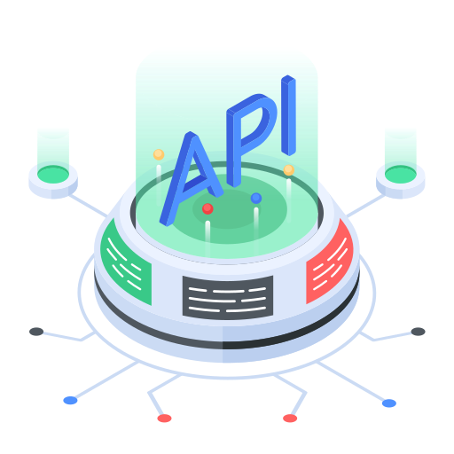
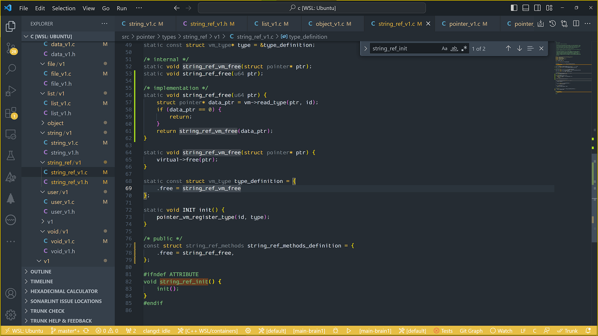
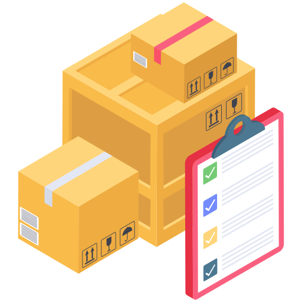

# c project

<a href="" target="blank"></a>

## description

Memory management and pointer management library in C

- cross-platfrom C library designed to create a safe C codebase.
- implementation of memory management/type system/GC in C

## features

- memory managemens
- GC
- type system
- pointer-free ABI

## dashboards

- [codacity] codacity

## status

[](https://app.codacy.com/gh/default-writer/c/dashboard?utm_source=gh&utm_medium=referral&utm_content=&utm_campaign=Badge_coverage)
[](https://github.com/default-writer/c/actions/workflows/c-cpp.yml)
[](https://sonarcloud.io/summary/new_code?id=default-writer_c)
[](https://coveralls.io/github/default-writer/c?branch=master)

## static analysis

[](https://app.codacy.com/gh/default-writer/c/dashboard?utm_source=gh&utm_medium=referral&utm_content=&utm_campaign=Badge_grade)[](https://sonarcloud.io/summary/new_code?id=default-writer_c)
[](https://sonarcloud.io/summary/new_code?id=default-writer_c)
[](https://sonarcloud.io/summary/new_code?id=default-writer_c)
[](https://sonarcloud.io/summary/new_code?id=default-writer_c)
[](https://sonarcloud.io/summary/new_code?id=default-writer_c)

## history

- 2025-09-10: added codacy tokens
- 2025-09-10: added support for [codacy][codacy]
- 2025-05-01: added support for MSVC
- 2025-02-28: added mocks for standart functions calloc/free to simulate out-ouf-memory function call flow

## examples

```c
static u64 read_data(const_vm_ptr cvm, u64 list_ptr, const char* prompt) {
    u64 data_ptr = 0;
    u64 ui_mode_ptr = CALL(string)->load(cvm, "UI_MODE");
    u64 mode_ptr = CALL(string)->load(cvm, "--ui");
    u64 value_ptr = CALL(env)->getenv(cvm, ui_mode_ptr);
    if (ui_mode_ptr != 0 && CALL(string)->strcmp(cvm, value_ptr, mode_ptr) != 0) {
        data_ptr = read_input(prompt);
    } else {
        printf(">%s:\n", prompt);
        data_ptr = CALL(list)->pop(list_ptr);
        if (data_ptr == 0) {
            printf("\n");
        }
    }
    return data_ptr;
}
```

```c
int main(void) {
    const_vm_ptr cvm = CALL(vm)->init(8); // initializes virtual memory manager with chunk size of 8

    // some work with standard classes: os, string, data, etc.

    CALL(vm)->gc();      // releases all resources added to GC
    CALL(vm)->destroy(); // releases virtual memory manager
    return 0;
}
```

## commands

```bash
./bin/cleanup.sh --clean
./bin/init.sh --clangd
./bin/init.sh --init --setup
./bin/coverageall.sh --all --clean
./bin/target.sh --target=main-tests-vm1 --release
./bin/cmake.sh --target=main-tests-vm1 --verbose --tty
./bin/lib.sh --c-sys
./bin/lib.sh --c-vm
```

## build commands

```bash
./bin/tmp.sh
./bin/cmake.sh --target=main-tests-vm1 --verbose --tty --clean
./bin/cmake.sh --target=main-tests-vm1 --verbose --tty --clean --release
./bin/cmake.sh --target=main-tests-vm1 --verbose --tty --clean --gc
./bin/cmake.sh --target=main-tests-vm1 --verbose --tty --clean --gc --release
./bin/coverageall.sh --all --clean
```

## resources

- [NASA](https://spinroot.com/gerard/pdf/P10.pdf)

## youtube

- [tsoding](https://www.youtube.com/watch?v=6dCqR9p0yWY&ab_channel=TsodingDaily)
- [tilir](https://github.com/tilir/c-graduate)
- [introduction to C (ru)](https://www.youtube.com/watch?v=7YhRFx-oyW4&ab_channel=KonstantinVladimirov)
- [practice C bash/linux/gcc (ru)](https://youtu.be/KLv-5jWlKjM)

## vision

- managed (C programming language model)
- safe
- friendly
- extensibe
- simple
- tested (100% code coverage)

## brief

<a href="" target="blank"></a>

- VM managed types / C API

- user defined types / extensibility system

  1. C API
  2. memory management
  3. garbage collection

- development environment:

  1. WSL2/devcontainers
  2. Ubuntu 18.04.6 / 22.04.3 / 24/.04.2 LTS
  3. MSVC

- C API generated docs (doxygen):

  1. [docs](./docs/refman.pdf)



## media links

<a href="" target="blank"></a>

- streaming channels

  1. [vk.com](https://vkvideo.ru/@club230014275)
  2. [twitch.tv](https://www.twitch.tv/defaultwriter/videos)
  3. [youtube.com](https://www.youtube.com/channel/UCrtPCqirYXdA2gYG8NxbTjA)

## music credits

- [imperss](https://soundcloud.com/imperss)

- [Adrian von Ziegler](https://soundcloud.com/adrian-von-ziegler)

## updates

<a href="" target="blank"></a>

- 2023

  1. added v1 core Virtual Machine (vm1) with types:
  2. added support including:

     1. file IO
     2. string manupulation methods
     3. search

## info

<a href="" target="blank"></a>

- `List<T>` implementations
- code coverage
- coverage hot-reload
- memory allocation playground
- automatic garbage collection implementation (GC)
- GTK GUI app demo ready to run on containerized environment

## readme

<a href="" target="blank"></a>

repo is ready to run on containers, WSL, remote hosts.

### remote development

- installation from git repo (manually)

Installs sources from git [repo](https://github.com/default-writer/c.git)

```bash
eval `ssh-agent -s`
git config --global user.name "$USER_NAME"
git config --global user.email "$USER_EMAIL"
git clone https://github.com/default-writer/c.git
```

## clang

[docs](https://manpages.ubuntu.com/manpages/jammy/man1/clangd-11.1.html)

## containers

<a href="" target="blank"></a>

### manual installation (minimal install)

- init

Sets up primary/optional tools and git hooks

```bash
./bin/init.sh --setup
./bin/init.sh --optional
./bin/init.sh --hooks
```

- rexo

```bash
./bin/utils/install.sh --submodule-rexo
```

## GTK GUI app development

<a href="" target="blank"></a>

### setup

- add/update Visual Studio Code environment settings:

```json
"environment": [
  {
    "name": "UI_MODE",
    "value": "--ui"
  }
]
```

- run command line build

```bash
cd gtk
./bin/build.sh --target gtk-experiment1 --clean
UI_MODE=--ui ./build/gtk-experiment1
```

## shell scripting documentation

### all shell scripts

- are self-documented
- placed in ./bin folders
- detects execution as user or root (sudo)
- runs with required and optional command-line parameters

## log

<a href="" target="blank"></a>

## local repos

Use [CLI](https://github.com/default-writer/tree/master/cli) or [git](https://github.com/default-writer/c.git).

## support C project

### sponsorship

support this project [become a sponsor](https://opencollective.com/c-vm#sponsor)

[](https://opencollective.com/c-vm/sponsor/0/website)

### 2023

- added support for classes / inheritance (oberon exaple)
- added GC implementation
- added several list implementations

### 2022

- playing around with visibility in class declarations

## documentation

### initialization

```bash
- ./bin/init.sh --setup
- ./bin/init.sh --hooks
- ./bin/init.sh --optional
```

## FAQ

- Q: Ninja generator not known (windows build)
- A: Download and Set Up Ninja Ninja for Windows

  1. Download the latest version from the official GitHub [releases][ninja] page
  2. Look for the ninja-win.zip file under the "Assets" section of the latest release.
  3. Extract the ninja.exe file from the zip archive.
  4. Create a new directory (e.g., C:\Tools\Ninja) and add it to your PATH.
  5. Place ninja.exe in a directory that is included in your system's PATH.

## doxygen generated documentation

<a href="" target="blank"></a>

[C API](docs/refman.pdf) PDF([refman.pdf][refman])

### referential documentation

- [nasa] NASA PDF([p10.pdf][nasa])
- [memory](docs/memory.md) PDF([memory.pdf][memory])
- [list](docs/list.md) PDF([list.pdf][list])
- [class](docs/class.md) PDF([class.pdf][class])
- [history](docs/history.md) PDF([history][history])
- [scripts](docs/scripts.md) PDF([scripts][scripts])
- [labs](docs/labs.md) PDF([labs][labs])

## resources

<a href="" target="blank"></a>

- [ubuntu](https://icons8.com/icon/63208/ubuntu") icon by [icons8](https://icons8.com)
- [vectorsmarket15](https://www.flaticon.com/authors/vectorsmarket15)
- [ecommerce icons](https://www.flaticon.com/free-icons/ecommerce)
- [flaticon](https://www.flaticon.com)

## links

<a href="" target="blank"></a>

- [git](https://git-scm.com)
- [pyenv](https://github.com/pyenv/pyenv)
- [python](https://www.python.org)
- [cmake](https://cmake.org)
- [docker](https://docker.com)
- [cli](https://github.com/cli/cli/blob/trunk/docs/install_linux.md)
- [hooks](https://git-scm.com/book/en/v2/Customizing-Git-Git-Hooks)

## requirements

<a href="" target="blank"></a>

- [rexo](https://github.com/christophercrouzet/rexo)

## code 

[](https://sonarcloud.io/summary/new_code?id=default-writer_c)

## C standart

- [The Current C Programming Language Standard – ISO/IEC 9899:2024 (C24)](https://blog.ansi.org/c-programming-language-standard-iso-iec-9899-2024/)
- [ISO/IEC 9899:2024 (en) — N3220 working draft](https://www.open-std.org/jtc1/sc22/wg14/www/docs/n3220.pdf)
- [C23 (C standard revision)](https://en.wikipedia.org/wiki/C23_(C_standard_revision))

## guidelines

- C guidelines in development of critical code (refers to [Secure Coding in C and C 2nd Edition][coding], Robert C. Seacord).
- NASA guidlines (refers to [The Power of Ten][nasa] – Rules for Developing Safety Critical Code, Gerard J. Holzmann, NASA/JPL Laboratory for Reliable Software, Pasadena, CA 91109)

## SAST Tools

[PVS-Studio](https://pvs-studio.com/en/pvs-studio/?utm_source=website&utm_medium=github&utm_campaign=open_source) - static analyzer for C, C++, C#, and Java code.

[codacy]: https://app.codacy.com/gh/default-writer/c/dashboard?branch=master
[refman]: docs/refman.pdf
[memory]: docs/pdf/memory.pdf
[list]: docs/pdf/list.pdf
[class]: docs/pdf/class.pdf
[history]: docs/pdf/history.pdf
[scripts]: docs/pdf/scripts.pdf
[labs]: docs/pdf/labs.pdf
[nasa]: docs/P10.pdf
[coding]: https://www.amazon.com/Secure-Coding-2nd-Software-Engineering/dp/0321822137
[ninja]: https://github.com/ninja-build/ninja/releases

## funding


- etherium: 0x035ebC06C7e667200695Cf8FC3686EEBBBD5A452
