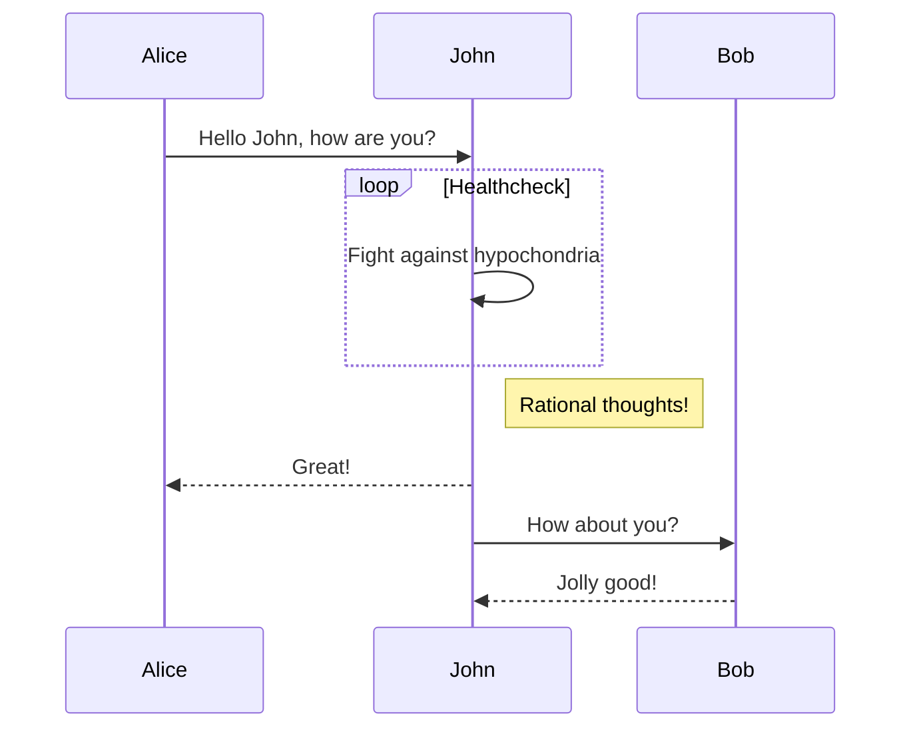
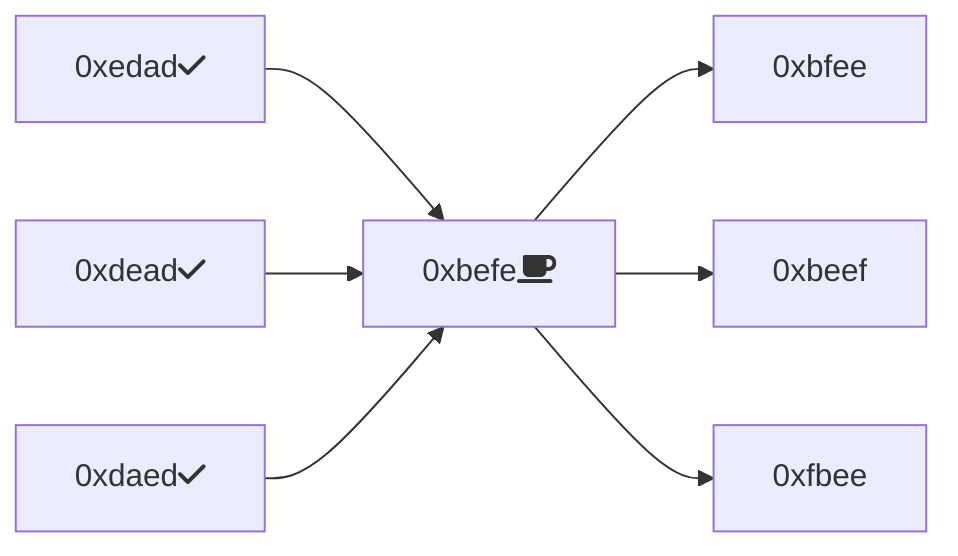

# memory

## sequence diagram

```mermaid
sequenceDiagram
Alice->>John: Hello John, how are you?
loop Healthcheck
    John->>John: Fight against hypochondria
end
Note right of John: Rational thoughts!
John-->>Alice: Great!
John->>Bob: How about you?
Bob-->>John: Jolly good!
```

## graph

```mermaid
graph LR
    0xedadfa:fa-check-->0xbefefa:fa-coffee
    0xdeadfa:fa-check-->0xbefefa:fa-coffee
    0xdaedfa:fa-check-->0xbefefa:fa-coffee
    0xbefefa:fa-coffee-->0xbfeefa:fa-salad
    0xbefefa:fa-coffee-->0xbeeffa:fa-salad
    0xbefefa:fa-coffee-->0xfbeefa:fa-salad
```
